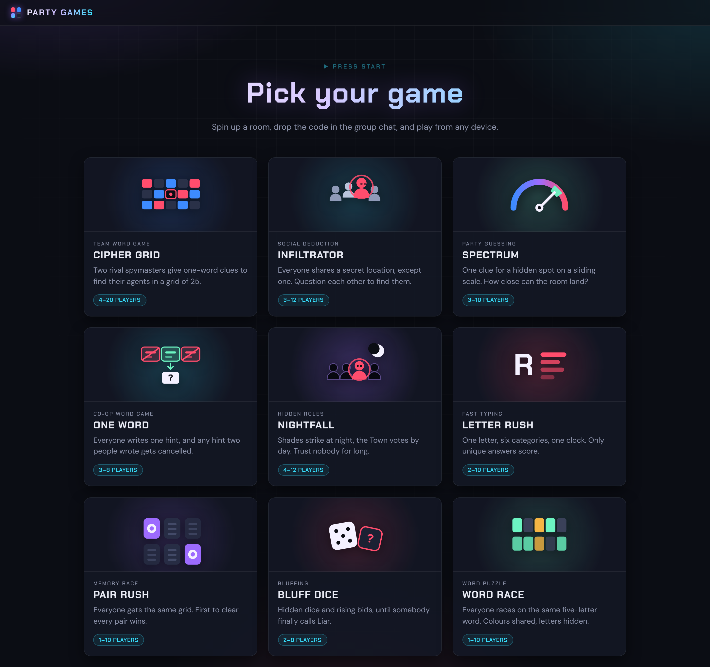
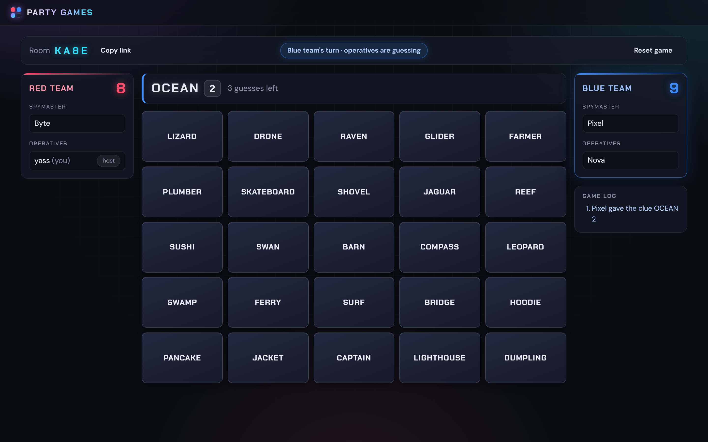
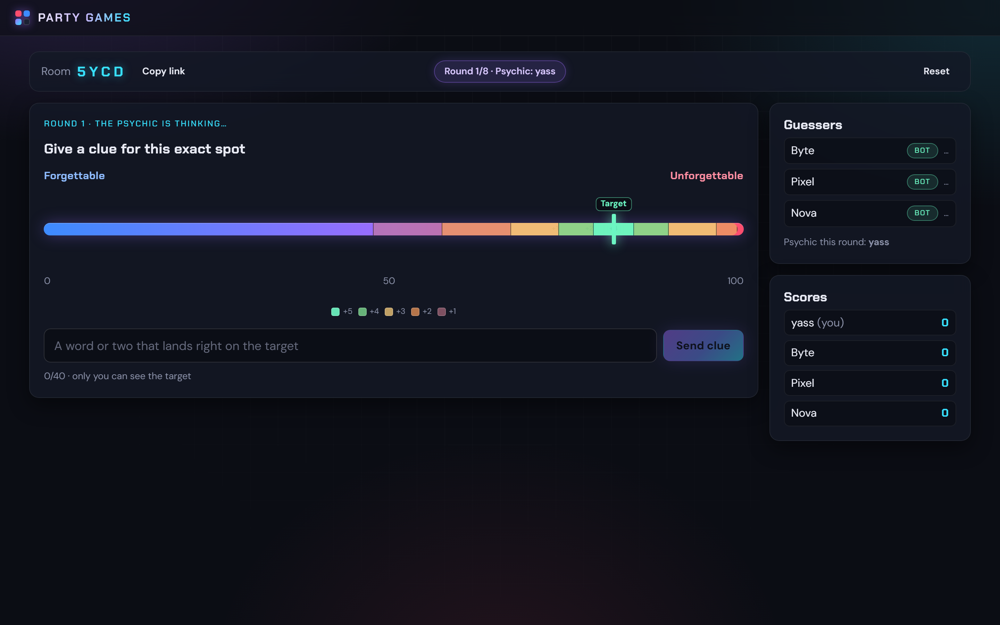
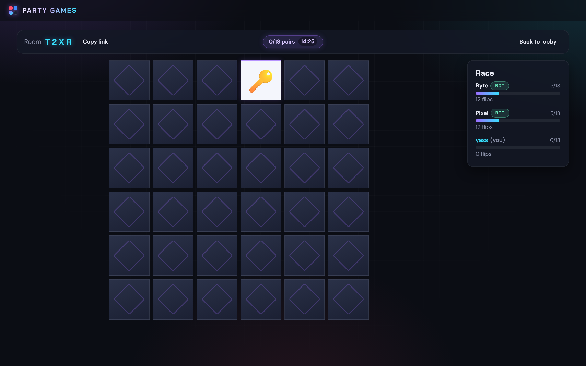

# Party Games

A website of original party games to play with friends across devices. Create a room, share the 4-letter code, and play.



**Games**

- **Cipher Grid** – a team word game. Two teams race to find their agents in a 5x5 grid of words. One player on
  each team knows the answers and gives one-word clues; their teammates guess. One card in the grid is a trap that
  loses the game instantly.
- **Infiltrator** – a social deduction game. Everyone secretly shares a location except one player, the
  infiltrator. Ask each other questions, accuse suspects, and vote before time runs out, while the infiltrator
  tries to work out where everyone is.
- **Spectrum** – one player sees a hidden target on a scale between two extremes and gives a clue. Everyone else
  places the dial. Closer guesses score more.
- **One Word** – cooperative. One player guesses; everyone else writes a single-word hint. Identical hints cancel
  each other out before the guesser sees them.
- **Nightfall** – hidden roles. Shades strike at night, the Oracle investigates, the Healer protects, and the town
  votes by day.
- **Letter Rush** – a random letter and six categories against the clock. Unique answers score; the room reviews
  and can veto dodgy ones.
- **Pair Rush** – everyone races the same shuffled memory grid; first to clear every pair wins.
- **Bluff Dice** – everyone hides a handful of dice and bids on how many of a face are on the table. Raise or call
  the liar.
- **Word Race** – everyone races to crack the same five-letter word. You see your rivals' colors but not their
  letters. Only real words are accepted as guesses: 12,653 of them, with answers drawn from a curated list of 846
  everyday words.

Every game supports **bots**, so a single host can try any of them alone.

At the end of a scored game everyone lands on a podium: tap another player to fling emoji at them, watch them
fly across every screen, pick up playful superlatives like Robot Uprising or Wooden Spoon, and set off confetti
for the whole room.

### A few of them in play

Cipher Grid — two teams, one grid, one-word clues:



Spectrum — the psychic sees the target and the scoring bands; everyone else sees only the clue:



Pair Rush — everyone races the same shuffled grid, with live progress on the right:



## Getting started

```bash
npm install
npm run dev
```

Open http://localhost:5173. The Vite dev server proxies Socket.IO traffic to the game server on port 3001.
To test multiplayer locally, open the room link in several browser windows (an incognito window counts as a separate player).

**Playing solo:** as host, press **+ Bot** in the lobby to add computer players. Bots fill empty seats, rebalance
around whatever role you pick, and act on their own with short delays. They always leave your role to you.

## Word Race dictionaries

Word Race validates guesses against a real dictionary, like Wordle does. The lists live in
`shared/wordrace/dict/` and are committed, so nothing is downloaded at runtime.

| Language | Accepted guesses | Possible answers |
| --- | --- | --- |
| English | 12,653 | 846 |
| French | 5,891 | 591 |

Answers are always everyday words; the larger guess list is what you are *allowed* to type. The host can also
paste a custom list of five-letter answers to theme a game, and guesses are then checked against the dictionary
plus those words. Regenerate the dictionaries with `npm run build:dict` after editing an answer list. See
[NOTICE.md](NOTICE.md) for the word-list sources and licences.

## Scripts

| Script              | What it does                                                        |
| ------------------- | ------------------------------------------------------------------- |
| `npm run dev`       | Runs the server (tsx watch) and client (Vite) together              |
| `npm run build`     | Builds the client to `dist/client` and server to `dist/server`      |
| `npm start`         | Serves the built client and API from one Node process               |
| `npm test`          | Runs the game-logic unit tests (Vitest)                             |
| `npm run typecheck` | Type-checks client and server                                       |
| `npm run e2e`       | Socket-level smoke tests for every game (needs the server running)  |
| `npm run build:dict`| Regenerates the Word Race word lists                                |

## Project layout

```
client/   React + Vite frontend
  src/pages/              Home page (game picker) and its SVG game icons
  src/lib/                Socket singleton, useRoom hook, GameEntry, GameRules, NumberField, Podium
  src/games/<game>/       One folder per game: entry page, room, components, <game>.css
server/   Express + Socket.IO backend
  src/rooms.ts                      Game-agnostic room manager (codes, seats, reconnect grace periods)
  src/socket.ts                     Connection handling, create/join/leave/bots, per-player broadcasts
  src/games/module.ts               The GameModule interface every game implements
  src/games/bots.ts                 Bot scheduling shared by every game
  src/games/<game>/module.ts        Per-game socket handlers, timers and bot behaviour
shared/   Code used by both sides
  room.ts                 Player / Room / RoomView types and the game registry
  protocol.ts             Typed Socket.IO event contracts, composed from each game
  errors.ts               UserError: messages safe to show players
  <game>/                 Types, pure rules (tested), events, and content per game
  wordrace/dict/          Generated word lists (committed; see NOTICE.md)
scripts/  End-to-end smoke tests, plus the dictionary generator
docs/     Contributor guides: adding-a-game.md, shared-ui.md
```

## How rooms work

- Rooms live in server memory. A player gets a persistent id in `localStorage`, so refreshing the page or
  reconnecting returns them to the same seat. A disconnected player keeps their seat for 2 minutes; an empty room
  is deleted after 10 minutes.
- The server sends each player their own view of the game, so hidden information (the Cipher Grid key, the
  Infiltrator location) never reaches players who should not see it.
- All rule enforcement lives in `shared/<game>/logic.ts` as pure functions and is unit-tested. The server module
  only decides who may do what (host-only actions, seat validation) and manages timers.

## Adding a new game

1. Add the game id to `GameId` and `GAME_INFO` in `shared/room.ts`.
2. Add types and pure rules under `shared/<game>/`, with tests. Throw `UserError` subclasses for player-facing errors.
3. Add the game's events to `ClientToServerEvents` in `shared/protocol.ts`.
4. Implement a `GameModule` under `server/src/games/<game>/module.ts` and add it to the module list in
   `server/src/index.ts`.
5. Add the UI under `client/src/games/<game>/` (reuse `GameEntry` for the create/join page), add routes in
   `client/src/App.tsx`, and list it in `client/src/pages/Home.tsx`.

## License and attribution

This project is released under the [MIT License](LICENSE).

All game names, rules implementations, prompts, categories, locations, roles and answer lists in this
repository are original work. The games are inspired by well-known party game genres but are not affiliated
with, endorsed by, or derived from any published board game or its publisher.

Word Race's guess dictionaries are generated from two MIT-licensed word-list packages, kept as
devDependencies and not shipped at runtime. Fonts come from Google Fonts under the SIL Open Font License.
See [NOTICE.md](NOTICE.md) for details.
